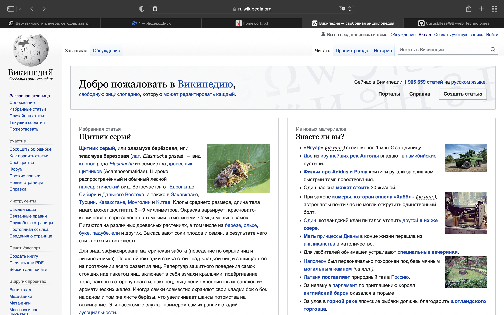
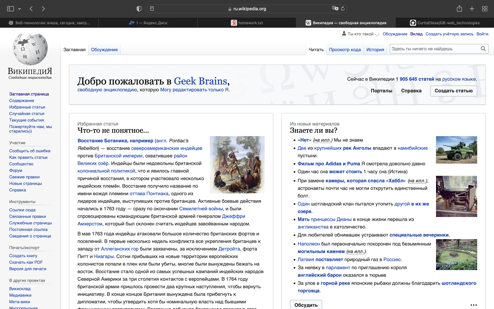
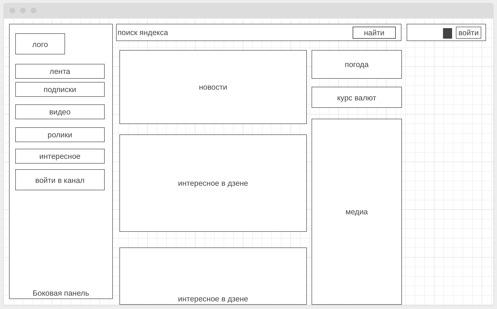

# Знакомство с веб-технологиями

```
Задача 1. Определите, на каком протоколе работает сайт youtube.com.
```

_Решение._ youtube.com работает на HTTPS протоколе. Это понятно по замочку в адресной строке. Также можно раскрыть домен и тоже увидеть HTTPS протокол. 
```
Задача 2. Описать сайт wikipedia.
```
_Решение._ [Анализ сайта Википедии.](2_analyze.txt)

**1 - HEADER.** В шапке указана личная информация в правом верхнем углу: "Обсуждение", "Вклад", "Создать учётную запись", "Войти" (если пользователь не зарегистрирован или не вошел в систему). Снизу слева представлена навигация: "Заглавная", "Обсуждение". Правее есть еще навигация: "Читать", "Просмотр кода", "История" и тут же поиск по википедии. Сама шапка не на весь экран, а вытесняется слева навигационной боковой панелью.

**2 - Навигационная боковая панель.** Сверху расположено лого. Основные элементы навигации: "Заглавная страница", "Содержание", "Избранные статьи", "Случайная статья", "Текущие события", "Пожертвовать". Дальше есть группы навигационных ссылок: "Участие", "Инструменты", "Печать/экспорт", "В других проектах", "На других языках".

**3 - BODY.** Содержит весь основной контент страницы. Контент разделен на блоки. Первый блок приветственный. В нем описано сколько статей всего есть и здесь же кнопки: "Порталы", "Справка", "Создать статью". Также отдельные блоки по категориям: "Избранная статья", "Из новых материалов", "Хорошая статья", "Последний избранный список", "Изображение дня", "Совместная работа недели", "В этот день" - показывает что происходило в этот день в истории, "Текущие события". Далее расположена информация об организации, владеющей этим сайтом, и других сайтах от этой организации.

**4 - FOOTER.** Подвал сайта на котором расположена вся юридическая информация: Лицензии, товарные знаки, условия пользования, отказ от ответственности, политика конфиденциальности, заявление о куки. Также есть: Описание Википедии, кнопка связи, Мобильная версия, Разработчики и Статистика и две кнопки показывающие принадлежность к WIKIMEDIA и MEDIAWIWKI.

```
Задача 3. Внесите не менее 10 изменений на страницу любой статьи сайта https://ru.wikipedia.org/, с помощью инструмента разработчика
```
> Я сначала поменяла страничку, потом сделала скриншот "ДО". Поэтому статья немного отличается на скриншотах. Но изменений было сделано 11.




```
Задача 4. Создайте прототип низкой детализации сайта https://dzen.ru/ с помощью сайта https://wireframe.cc/. 
```

